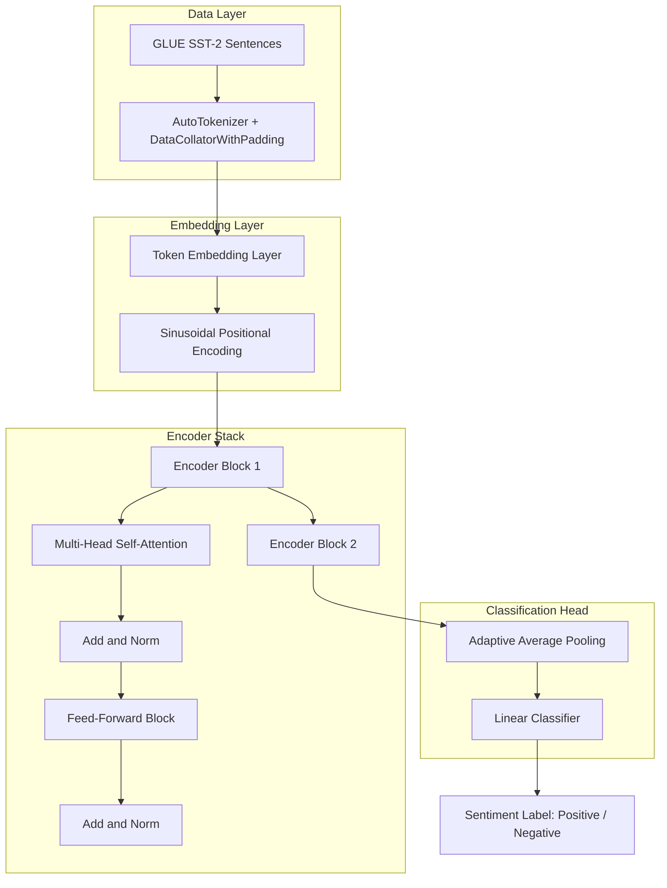
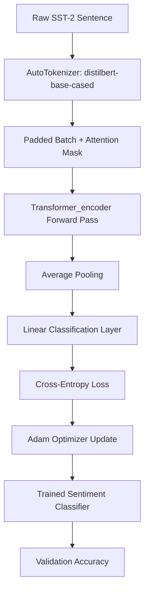

<div align="center">

</div>

---

# Transformer Encoder for Sentiment Classification on SST-2

A PyTorch implementation of the Transformer encoder introduced in *Attention Is All You Need*, built block by block — scaled dot-product attention, multi-head attention, layer normalization, positional encoding, and residual encoder blocks — and trained end-to-end for binary sentiment classification on the GLUE SST-2 benchmark.

<div align="left">

[](https://www.python.org/)
[](https://pytorch.org/)
[](https://huggingface.co/docs/transformers)
[](https://gluebenchmark.com/tasks)
[](https://arxiv.org/abs/1706.03762)
[](#)
[](https://colab.research.google.com/)
[](https://opensource.org/licenses/MIT)

</div>

## Abstract

This project implements the encoder side of the Transformer architecture proposed by Vaswani et al. in [*Attention Is All You Need*](https://arxiv.org/abs/1706.03762) entirely from first principles in PyTorch, without relying on high-level modules such as `nn.MultiheadAttention` or `nn.TransformerEncoder`. Scaled dot-product attention is built up progressively — from a naive two-loop formulation to a fully vectorized, batched implementation — followed by multi-head attention, layer normalization, position-wise feed-forward blocks, and sinusoidal positional encoding. These components are assembled into a complete Transformer encoder and coupled with an average-pooling classification head to perform binary sentiment classification on the **GLUE SST-2** dataset, using a Hugging Face tokenizer purely for text preprocessing.

## Table of Contents

1. [Overview](#overview) — Motivation and Problem Definition
2. [System Architecture](#system-architecture) — End-to-End Sentiment Classification Pipeline
3. [Model Components](#model-components) — Attention, Normalization, and Encoder Blocks
   - 3.1 [Scaled Dot-Product Attention](#31-scaled-dot-product-attention)
   - 3.2 [Multi-Head Attention](#32-multi-head-attention)
   - 3.3 [Positional Encoding](#33-positional-encoding)
   - 3.4 [Encoder Block and Feed-Forward Network](#34-encoder-block-and-feed-forward-network)
4. [Sentiment Classification Head](#sentiment-classification-head) — From Encoder Output to Prediction
5. [Training Workflow](#training-workflow) — From Raw Text to Optimized Weights
6. [Experimental Setup](#experimental-setup) — Data, Tokenization, and Hyperparameters
7. [Project Structure](#project-structure) — Repository Organization
8. [Usage and Installation](#usage-and-installation)
9. [License](#license)
10. [Author](#author)
11. [Support](#support)

# Overview

Self-attention allows a model to weigh every token in a sequence against every other token in parallel, removing the sequential bottleneck and vanishing-gradient issues of recurrent architectures. This project explores that mechanism hands-on by re-implementing the Transformer encoder from the ground up and validating it on a real downstream task rather than synthetic tensors alone.

The pipeline covers the full experimental cycle:

- Implementing scaled dot-product attention at three levels of abstraction (single-sample loop, batched loop, and fully vectorized) to build intuition before optimizing for performance
- Building `SelfAttention` and `MultiHeadAttention` as standalone, testable `nn.Module` blocks
- Implementing `LayerNormalization` and a position-wise `FeedForwardBlock`
- Assembling an `EncoderBlock` with residual connections and stacking it into a full `Encoder`
- Implementing both a simple and a sinusoidal positional encoding scheme
- Wrapping the encoder in a `Transformer_encoder` model with an average-pooling classification head
- Tokenizing and loading the GLUE SST-2 dataset with a Hugging Face `AutoTokenizer` and `DataCollatorWithPadding`
- Training and validating the model end-to-end on binary sentiment classification

# System Architecture

The system is organized as a layered pipeline in which raw text is tokenized, embedded, positionally encoded, and passed through a stack of custom Transformer encoder blocks before being pooled and classified.



### Architectural Components

| Layer               | Responsibility                                                          |
| :-------------------- | :------------------------------------------------------------------------ |
| Data Layer           | Loading GLUE SST-2 and tokenizing sentences with padding/attention masks |
| Embedding Layer      | Token embeddings combined with sinusoidal positional encodings           |
| Encoder Stack        | Stacked custom encoder blocks with multi-head self-attention and residual connections |
| Classification Head  | Average pooling over token representations followed by a linear layer   |

This design keeps every building block — attention, normalization, and feed-forward transformation — implemented explicitly, making the internal mechanics of the Transformer encoder fully transparent rather than hidden behind a library call.

# Model Components

## 3.1 Scaled Dot-Product Attention

The core attention primitive is implemented in three progressively optimized forms to highlight both correctness and the computational cost of naive implementations:

- **Two-loop, single sequence** — iterates over every query and every key explicitly
- **Two-loop, batched** — extends the single-sequence version across a batch dimension
- **Fully vectorized, batched** — replaces both loops with batched matrix multiplications (`torch.bmm`) and an optional attention mask, matching the efficiency required for real training

Each query, key, and value dot product is scaled by `1/sqrt(M)` (where `M` is the embedding dimension) before a softmax normalizes the attention weights, which are then used to compute a weighted sum over the value vectors.

## 3.2 Multi-Head Attention

`MultiHeadAttention` projects the input into multiple lower-dimensional query, key, and value subspaces, applies scaled dot-product attention independently in each head, and concatenates the results before a final linear projection. This lets the model attend to different representation subspaces simultaneously rather than relying on a single attention distribution.

## 3.3 Positional Encoding

Since self-attention has no inherent notion of token order, positional information is injected explicitly through two schemes:

- `position_encoding_simple` — a lightweight, non-learnable baseline encoding
- `position_encoding_sinusoid` — the sine/cosine encoding from the original paper, added directly to the token embeddings before they enter the encoder stack

## 3.4 Encoder Block and Feed-Forward Network

`LayerNormalization` is implemented from scratch to stabilize activations per token rather than per batch, making it well suited to variable-length sequences. Each `EncoderBlock` combines multi-head self-attention and a position-wise `FeedForwardBlock`, each wrapped in a residual connection followed by layer normalization, and multiple blocks are stacked to form the full `Encoder`.

# Sentiment Classification Head

The `Transformer_encoder` model ties all components together for the downstream task: input token IDs are embedded, combined with sinusoidal positional encodings, passed through the stacked encoder, average-pooled across the sequence dimension with `nn.AdaptiveAvgPool1d`, and finally projected to two output logits corresponding to the positive and negative sentiment classes.

# Training Workflow



# Experimental Setup

| Component            | Configuration                                       |
| :--------------------- | :---------------------------------------------------- |
| Dataset               | GLUE SST-2 (binary sentiment classification)         |
| Tokenizer             | `distilbert-base-cased` (`AutoTokenizer`, preprocessing only) |
| Embedding Dimension   | 512                                                   |
| Attention Heads       | 2                                                     |
| Feed-Forward Dimension| 512                                                   |
| Encoder Layers        | 2                                                      |
| Dropout               | 0.3                                                    |
| Positional Encoding   | Sinusoidal                                             |
| Batch Size            | 8                                                       |
| Optimizer             | Adam                                                    |
| Loss Function         | Cross-Entropy                                           |
| Epochs                | 4                                                       |
| Output Classes        | 2 (Positive / Negative)                                 |

# Project Structure

```text
Transformer-Encoder-for-Sentiment-Classification
│
├── transformers_sentiment_analysis.ipynb   # Main notebook: implementation, unit tests, and training
├── transformers_sentiment_analysis.py      # Core Transformer encoder implementation
├── a5_helper.py                            # Testing and validation utilities
├── helpers_module/                         # Shared data and training utilities
├── requirements.txt                        # Dependencies
└── README.md
```

# Usage and Installation

```bash
# 1. Clone the repository
git clone https://github.com/ParmidaGh/Transformer-Encoder-from-Scratch-for-Sentiment-Classification-on-SST-2.git
cd Transformer-Encoder-from-Scratch-for-Sentiment-Classification-on-SST-2

# 2. Create and activate the environment
conda create -n transformer-sst2 python=3.10
conda activate transformer-sst2

# 3. Install dependencies
pip install -r requirements.txt
# Core deps: torch, transformers, datasets
```

### Reproducibility

Run the cells of `transformers_sentiment_analysis.ipynb` sequentially. A CUDA-enabled GPU is recommended (e.g., Google Colab). Each component (attention, multi-head attention, layer normalization, feed-forward, encoder block) includes a dedicated test cell comparing outputs and gradients against reference values.

# License

This project is licensed under the MIT License.

---

## Author

**Parmida Ghamari**
M.Sc. Student, University of Tehran
Research Assistant @ Social Networks Lab

**Research Interests:** Natural Language Processing (NLP), Transformer Architectures, Attention Mechanisms, Sequence Modeling, Sentiment Analysis, Deep Learning

📧 [Parmida.ghamari@gmail.com](mailto:Parmida.ghamari@gmail.com) | 💻 [github.com/ParmidaGh](https://github.com/ParmidaGh) | 💼 [linkedin.com/in/parmida-ghamari](https://www.linkedin.com/in/parmida-ghamari)

---

# Support

If you find this project useful, consider giving it a star ⭐️

---

<p align="center">
Built with ❤️ using PyTorch and Hugging Face
</p>
